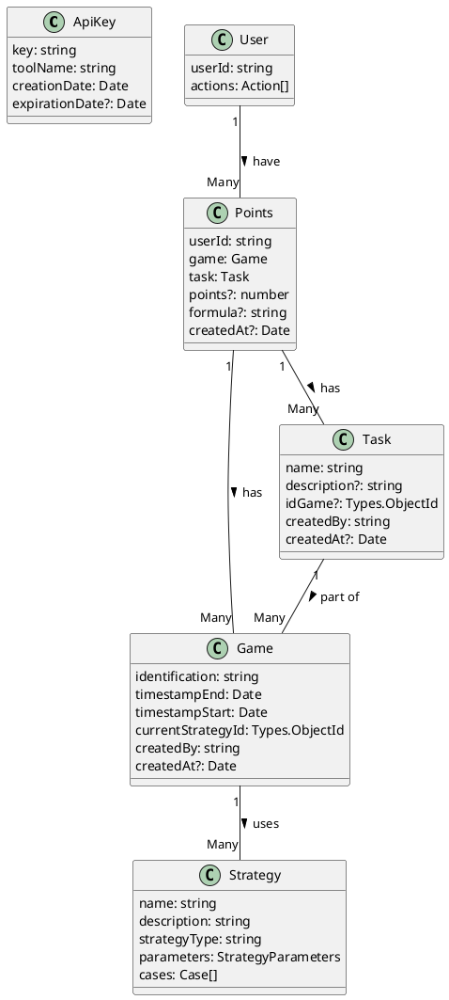

# Entity-Relationship Diagram (ERD) Documentation

## Overview

This document outlines the Entity-Relationship Diagram (ERD) for a set of models using PlantUML. The ERD visually represents the entities (models) and their relationships within a system. It's a crucial part of understanding and documenting the system's data structure.

## Models Description

The system consists of the following models:

- **ApiKey**
- **Game**
- **Points**
- **Strategy**
- **Task**
- **User**

Each model has its own set of attributes and is interconnected with other models through various relationships.

## PlantUML Code

Below is the PlantUML code used to generate the ERD:

## Generating the Diagram

To generate the ERD from this code:

1. Copy the provided PlantUML code.
2. Open a PlantUML editor (e.g., [PlantUML Web Server](https://www.plantuml.com/plantuml/uml/SyfFKj2rKt3CoKnELR1Io4ZDoSa70000)).
3. Paste the code into the editor.
4. The editor will automatically render the ERD.

## Understanding the Diagram

- Each `class` in the PlantUML code represents an entity (model) in the system.
- The attributes within each class define the properties of each model.
- Relationships are depicted with lines connecting the entities:
  - `"1" -- "Many"` indicates a one-to-many relationship.
  - The labels (`: uses >`, `: has >`, `: part of >`, `: have >`) describe the nature of the relationship.

## Conclusion

This ERD provides a visual representation of the system's data structure, highlighting how different models are related and interact with each other. It's an essential tool for developers and database designers to understand and work with the system's data architecture effectively.
