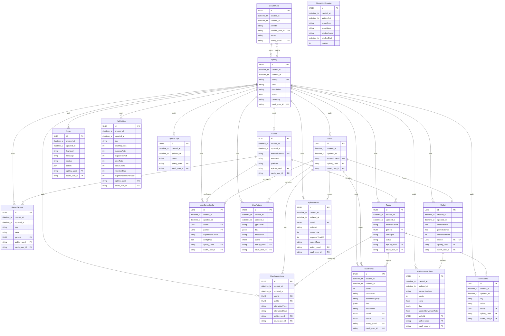

# GAME - Domain Model

Complete entity-relationship diagram for the GAME (Goals And Motivation Engine) schema.
Every entity, attribute, and foreign-key relationship is captured below.

```mermaid
erDiagram

    %% ─────────────────────────────────────────
    %% AUTHENTICATION & ACCESS CONTROL
    %% ─────────────────────────────────────────

    OAuthUsers {
        UUID        id               PK
        datetime_tz created_at
        datetime_tz updated_at
        string      provider
        string      provider_user_id UK
        string      status
        string      apiKey_used      FK
    }

    ApiKey {
        UUID        id               PK
        datetime_tz created_at
        datetime_tz updated_at
        string      apiKey           UK
        string      client
        string      description
        bool        active
        string      createdBy
        string      oauth_user_id    FK
    }

    %% ─────────────────────────────────────────
    %% CORE DOMAIN: USERS
    %% ─────────────────────────────────────────

    Users {
        UUID        id               PK
        datetime_tz created_at
        datetime_tz updated_at
        string      externalUserId   UK
        string      apiKey_used      FK
        string      oauth_user_id    FK
    }

    %% ─────────────────────────────────────────
    %% CORE DOMAIN: CAMPAIGNS (GAMES & TASKS)
    %% ─────────────────────────────────────────

    Games {
        UUID        id               PK
        datetime_tz created_at
        datetime_tz updated_at
        string      externalGameId   UK
        string      strategyId
        string      platform
        string      apiKey_used      FK
        string      oauth_user_id    FK
    }

    GameParams {
        UUID        id               PK
        datetime_tz created_at
        datetime_tz updated_at
        string      key
        string      value
        UUID        gameId           FK
        string      apiKey_used      FK
        string      oauth_user_id    FK
    }

    Tasks {
        UUID        id               PK
        datetime_tz created_at
        datetime_tz updated_at
        string      externalTaskId
        UUID        gameId           FK
        string      strategyId
        string      status
        string      apiKey_used      FK
        string      oauth_user_id    FK
    }

    TaskParams {
        UUID        id               PK
        datetime_tz created_at
        datetime_tz updated_at
        string      key
        string      value
        UUID        taskId           FK
        string      apiKey_used      FK
        string      oauth_user_id    FK
    }

    %% ─────────────────────────────────────────
    %% USER <-> GAME PARTICIPATION
    %% ─────────────────────────────────────────

    UserGameConfig {
        UUID        id               PK
        datetime_tz created_at
        datetime_tz updated_at
        UUID        userId           FK
        UUID        gameId           FK
        string      experimentGroup
        json        configData
        string      apiKey_used      FK
        string      oauth_user_id    FK
    }

    UserActions {
        UUID        id               PK
        datetime_tz created_at
        datetime_tz updated_at
        string      typeAction
        jsonb       data
        string      description
        UUID        userId           FK
        string      apiKey_used      FK
        string      oauth_user_id    FK
    }

    UserInteractions {
        UUID        id                PK
        datetime_tz created_at
        datetime_tz updated_at
        UUID        userId            FK
        UUID        taskId            FK
        string      interactionType
        string      interactionDetail
        string      apiKey_used       FK
        string      oauth_user_id     FK
    }

    UserPoints {
        UUID        id               PK
        datetime_tz created_at
        datetime_tz updated_at
        int         points
        string      caseName
        string      idempotencyKey
        jsonb       data
        string      description
        UUID        userId           FK
        UUID        taskId           FK
        string      apiKey_used      FK
        string      oauth_user_id    FK
    }

    %% ─────────────────────────────────────────
    %% WALLET & ECONOMY
    %% ─────────────────────────────────────────

    Wallet {
        UUID        id               PK
        datetime_tz created_at
        datetime_tz updated_at
        float       coinsBalance
        float       pointsBalance
        int         conversionRate
        UUID        userId           FK "UK"
        string      apiKey_used      FK
        string      oauth_user_id    FK
    }

    WalletTransactions {
        UUID        id                    PK
        datetime_tz created_at
        datetime_tz updated_at
        string      transactionType
        int         points
        float       coins
        jsonb       data
        float       appliedConversionRate
        UUID        walletId              FK
        string      apiKey_used           FK
        string      oauth_user_id         FK
    }

    %% ─────────────────────────────────────────
    %% OBSERVABILITY & OPERATIONS
    %% ─────────────────────────────────────────

    ApiRequests {
        UUID        id               PK
        datetime_tz created_at
        datetime_tz updated_at
        UUID        userId           FK
        string      endpoint
        int         statusCode
        int         responseTimeMS
        string      requestType
        string      apiKey_used      FK
        string      oauth_user_id    FK
    }

    Logs {
        UUID        id               PK
        datetime_tz created_at
        datetime_tz updated_at
        string      log_level
        string      message
        string      module
        json        details
        string      apiKey_used      FK
        string      oauth_user_id    FK
    }

    KpiMetrics {
        UUID        id                     PK
        datetime_tz created_at
        datetime_tz updated_at
        string      day
        int         totalRequests
        int         successRate
        int         avgLatencyMS
        int         errorRate
        int         activeUsers
        int         retentionRate
        int         avgInteractionsPerUser
        string      apiKey_used            FK
        string      oauth_user_id          FK
    }

    UptimeLogs {
        UUID        id               PK
        datetime_tz created_at
        datetime_tz updated_at
        string      status
        string      apiKey_used      FK
        string      oauth_user_id    FK
    }

    %% ─────────────────────────────────────────
    %% RATE LIMITING
    %% ─────────────────────────────────────────

    AbuseLimitCounter {
        UUID        id          PK
        datetime_tz created_at
        datetime_tz updated_at
        string      scopeType
        string      scopeValue
        string      windowName
        datetime_tz windowStart
        int         counter
    }

    %% ─────────────────────────────────────────
    %% RELATIONSHIPS
    %% ─────────────────────────────────────────

    %% Auth layer
    OAuthUsers      ||--o{ ApiKey             : "owns"
    ApiKey          ||--o{ OAuthUsers         : "used by"

    %% ApiKey audit trail - every BaseModel entity records which key created it
    ApiKey          ||--o{ Users              : "audit"
    ApiKey          ||--o{ Games              : "audit"
    ApiKey          ||--o{ GameParams         : "audit"
    ApiKey          ||--o{ Tasks              : "audit"
    ApiKey          ||--o{ TaskParams         : "audit"
    ApiKey          ||--o{ UserGameConfig     : "audit"
    ApiKey          ||--o{ UserActions        : "audit"
    ApiKey          ||--o{ UserInteractions   : "audit"
    ApiKey          ||--o{ UserPoints         : "audit"
    ApiKey          ||--o{ Wallet             : "audit"
    ApiKey          ||--o{ WalletTransactions : "audit"
    ApiKey          ||--o{ ApiRequests        : "audit"
    ApiKey          ||--o{ Logs               : "audit"
    ApiKey          ||--o{ KpiMetrics         : "audit"
    ApiKey          ||--o{ UptimeLogs         : "audit"

    %% Campaign hierarchy
    Games           ||--o{ GameParams         : "parameterized by"
    Games           ||--o{ Tasks              : "contains"
    Tasks           ||--o{ TaskParams         : "parameterized by"

    %% User participation
    Games           ||--o{ UserGameConfig     : "configures"
    Users           ||--o{ UserGameConfig     : "enrolled in"
    Users           ||--o{ UserActions        : "performs"
    Users           ||--o{ UserInteractions   : "has"
    Tasks           ||--o{ UserInteractions   : "tracked by"
    Users           ||--o{ UserPoints         : "earns"
    Tasks           ||--o{ UserPoints         : "awards"

    %% Economy
    Users           ||--||  Wallet            : "owns"
    Wallet          ||--o{ WalletTransactions : "records"

    %% Observability
    Users           ||--o{ ApiRequests        : "makes"
```
